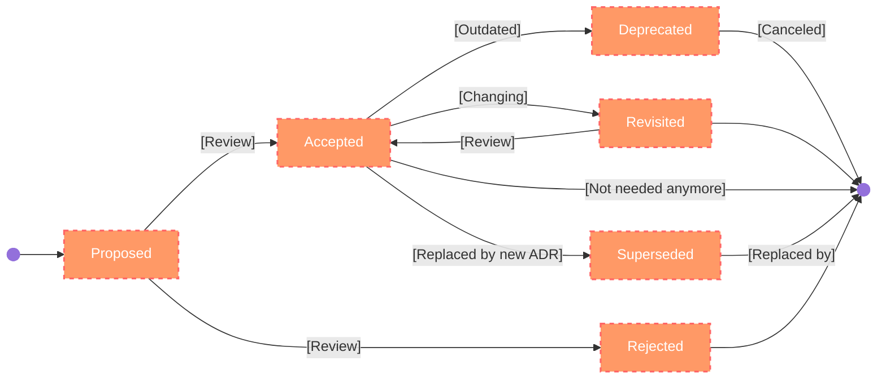

# ADR Template

## Title

A good format for the title is `ADR-nnnn` or `yyyy-mm-dd` followed by a description of the proposed topic. The nnnn component represents a sequential number starting from 1.

For example, `ADR-0002`,`2025-01-10` or `ADR-0002-ContainerD-as-Kubernetes-CRI.md`

## Ownership

ADR ownership refers to the accountability and responsibility for maintaining the accuracy, relevance, and lifecycle of an Architecture Decision Record (ADR). Ownership ensures that decisions are clearly documented, regularly reviewed, and updated as the project evolves. 

Key aspects include:

* __Responsibility__:
  * A designated owner (e.g., the author, a team, or a lead architect) ensures the ADR reflects the latest understanding and direction of the project.
* __Lifecycle Management__:
  * Owners oversee the ADR’s status, transitioning it through phases like "Proposed," "Accepted," "Superseded," or "Deprecated."
* __Collaboration__:
  * The ADR owner facilitates discussions, collects feedback, and incorporates stakeholder input to maintain alignment across teams.
* __Transparency__:
  * Clear ownership promotes traceability, enabling everyone involved to understand who to contact for questions or further context.

Effective ADR ownership is crucial for fostering accountability and keeping architectural documentation consistent and relevant.

### Exmaple

* Include the authors' names and email addresses.
* Add a stakeholder or contributor list

## Status

The status of an Architecture Decision Record (ADR) is typically represented as an enumeration (enum) to indicate the current state of the decision within the project lifecycle. Common statuses include:

* __Proposed__:
  * The decision is under consideration and open for discussion. No final agreement has been reached.
* __Accepted__:
  * The decision has been reviewed and agreed upon by stakeholders. It is now part of the system architecture.
* __Rejected__:
  * The decision has been considered but was ultimately not approved or implemented.
* __Deprecated__:
  * The decision is no longer valid due to changes in requirements, technologies, or system priorities. It has been replaced or is planned for removal.
* __Superseded__:
  * The decision has been replaced by another ADR that reflects a more up-to-date solution.
* __Implemented__:
  * The decision has been fully integrated into the system and is currently in use.
* __Revisited__:
  * The decision is being reviewed to assess its relevance or effectiveness, usually triggered by new information or changing conditions.

Each status helps track the evolution of architectural decisions and ensures that all stakeholders understand their current standing and applicability in the project.

__Picture 5__: ADR state flow

## Context - (Why)

The context of an Architecture Decision Record (ADR) provides the background and rationale for the decision. It describes the situation or problem that led to the decision, including relevant technical, business, or environmental factors. This may include project requirements, constraints, existing systems, team preferences, or stakeholder needs. The goal is to clearly outline the "why" behind the decision, giving future readers an understanding of the circumstances and challenges at the time the decision was made.ne particular route to be more challenging.

### Example

__Context of the Decision__: Adoption of Containerd as the Primary Kubernetes CRI

As our project evolves, selecting a robust and reliable Container Runtime Interface (CRI) for Kubernetes is critical to ensure optimal performance, flexibility, and long-term sustainability. The CRI serves as the foundation for managing container lifecycle operations within our Kubernetes infrastructure, influencing both the efficiency of orchestration and the maintainability of the system.

Historically, the landscape of CRIs has included various options, such as Docker and Containerd. However, Kubernetes deprecating Docker as a CRI in favor of more native solutions underscores the need to transition to a runtime fully aligned with Kubernetes’ architecture and ecosystem.

Containerd stands out due to its modular architecture, robust support for container management features, and strong compatibility with Kubernetes. It has been officially adopted by the CNCF and widely embraced by leading Kubernetes platforms, such as Google Kubernetes Engine (GKE), Amazon Elastic Kubernetes Service (EKS), and Azure Kubernetes Service (AKS). Additionally, its lightweight design and performance optimizations make it a natural fit for our scalability and efficiency goals.

This decision to adopt Containerd is also motivated by its:

* Seamless integration with Kubernetes.
* Proven extensibility to support diverse workloads.
* Comprehensive documentation and community support, ensuring resources for current and future challenges.

In summary, adopting Containerd as our primary Kubernetes CRI aligns with industry standards, future Kubernetes developments, and our project's goals for scalability, flexibility, and maintainability. This decision ensures our runtime infrastructure is future-proof while minimizing complexity and enhancing ecosystem alignment.

## Decision -  (What/How)

The Decision section of an Architecture Decision Record (ADR) clearly outlines the specific choice made to address the context or problem described. It answers the question: What was decided? This section should be concise yet detailed enough to eliminate ambiguity and serve as the definitive statement of action.

Key characteristics of the Decision section:

* __Clarity__:
  * Clearly state the selected option or approach. Avoid vague or overly technical language that might confuse readers.
* __Specificity__:
  * Include concrete details about what will be done. For example, specify the tools, patterns, or technologies involved.
* __Justification__:
  * Although the reasoning is elaborated in other sections (like Consequences), briefly touch on why this decision is appropriate.
* __Scope__:
  Define the boundaries or extent of the decision, specifying any particular areas or components it affects.

### Example:

__Decision__: Adopting Containerd as the Primary Kubernetes CRI

We will adopt containerd as the primary Kubernetes Container Runtime Interface (CRI) for the project. This decision is based on Containerd’s robust support for a wide range of low-level container runtimes, its modular architecture, and its proven extensibility, which align well with our project's goals for flexibility and scalability.

Containerd is a lightweight and high-performance container runtime that integrates seamlessly with Kubernetes, providing key features such as image management, container lifecycle operations, and runtime abstraction. Its design allows for a strong separation of concerns between runtime operations and orchestration, enhancing maintainability and compatibility.

Additionally, Containerd benefits from exceptional community support as a CNCF-graduated project, with extensive documentation, active development, and widespread adoption across major Kubernetes platforms and distributions, such as GKE, EKS, and AKS. Leveraging Containerd aligns our project with these cloud-native standards, improving ecosystem compatibility and long-term viability.

Given that the majority of Kubernetes-based clouds and distributions already use Containerd, adopting it will reduce the complexity of integration efforts and increase alignment with future upstream developments in Kubernetes. This decision ensures we adopt a well-supported, future-proof solution for container runtime management.

## Alternatives: Options considered, with reasons for rejection.

The Alternatives section of an Architecture Decision Record (ADR) describes the other options considered during the decision-making process. It provides insight into the reasoning behind the chosen approach by showcasing what was evaluated and why these alternatives were not selected. This section demonstrates thorough analysis, supports future reassessments, and documents lessons learned.

Structure of the Alternatives Section:

* __Option Name and Description__:
  * Briefly describe the alternative, including its key features and potential relevance to the problem.
* __Pros__:
  * Highlight the advantages or benefits of the alternative.
* __Cons__:
  * Note the drawbacks, risks, or limitations associated with the alternative.
* __Reasons for Rejection__:
  * Summarize why the alternative was ultimately not chosen, considering factors like feasibility, cost, alignment with goals, or compatibility with existing systems.

### Example:

__Alternatives Considered__:

* __Alternative A__: Docker as the Kubernetes Container Runtime Interface (CRI)
  * __Pros__: Widely adopted, mature tooling, and strong familiarity among developers.
  * __Cons__: Docker's CRI is deprecated in Kubernetes, leading to limited long-term support.
  * __Reason for Rejection__: Dependency on deprecated technology posed a significant risk to project sustainability.
* __Alternative B__: CRI-O
  * __Pros__: Lightweight and optimized for Kubernetes. Direct support for OCI standards.
  * __Cons__: Smaller community and fewer plugins compared to Containerd.
  * __Reason for Rejection__: Lack of ecosystem integration and extensibility compared to Containerd.

By thoroughly documenting these alternatives, the ADR provides a comprehensive view of the decision-making process, ensuring that future stakeholders understand the context and rationale behind the chosen solution.

## Consequences

In this section, we outline the outcomes of the decision, considering both its positive and negative impacts. Key components include:

* __Effects__:
  * The consequences or implications of the decision, detailing its impact on the system or processes.
* __Outputs__:
  * The deliverables resulting from this decision, which may include new artifacts, changes, or even additional ADRs. Addressing one decision often leads to identifying new questions to explore.
* __Follow-Ups__:
  * Any subsequent actions, tasks, or considerations required to fully implement the decision.
* __ADR Reviews__:
  *A plan to revisit and evaluate the decision and its effectiveness after the implementation, possibly scheduling a review date to assess the outcome.

To ensure accountability and clarity, all outcomes should have corresponding tickets created to track the related tasks and progress effectively.

### Example

__Consequences__: Adopting Containerd as the Primary Kubernetes CRI

* __Improved Flexibility and Scalability__:
  * Containerd's modular architecture and extensibility provide the project with a robust foundation for adapting to evolving requirements and scaling efficiently.
* __Enhanced Integration and Compatibility__:
  * Containerd is a CNCF-graduated project widely adopted by major Kubernetes platforms such as GKE, EKS, and AKS. Aligning with this standard reduces integration complexity and ensures compatibility with future Kubernetes developments.
* __Better Maintainability__:
  * The strong separation of concerns between runtime operations and orchestration simplifies maintenance and fosters a cleaner, more manageable system architecture.
* __Community Support and Ecosystem Benefits__:
  * Containerd enjoys active community engagement, extensive documentation, and a large user base, offering reliable support and resources to address challenges effectively.
* __Future-Proof Solution__:
  * The adoption of Containerd aligns the project with cloud-native standards and industry trends, ensuring long-term viability and reducing risks of technical debt.
* __Streamlined Operations__:
  * The lightweight and high-performance design of Containerd improves overall operational efficiency while supporting essential container management features like image handling and runtime abstraction.

By adopting Containerd, the project leverages a stable, well-supported CRI, facilitating operational excellence and aligning with Kubernetes ecosystem best practices.

## Notes

To ensure clarity, traceability, and ease of access, include the following components in an ADR:

* __Creation Date__:
  * The original date when the ADR was created, providing temporal context for the decision.
* __Tags__:
  * Relevant tags or labels that categorize the ADR (e.g., "Database," "Scalability," "API"), helping stakeholders quickly identify related topics.
* __Keywords__:
  * Specific terms associated with the decision, optimized for searchability within project documentation or repositories.
* __History__:
  * A chronological narrative of the ADR’s evolution, including discussions, iterations, and major milestones.
* __Changelog__:
  * A record of updates or revisions made to the ADR, including dates, descriptions of changes, and the responsible individual or team.
* __Meetings__:
  * A chronological list of disussion meetings
* __Cross References:__:
  * A list of other ADRs or important hints

These elements enhance the usability and maintainability of ADRs, making them more valuable as a resource for teams.

## References

* [A Definition of Done for Architectural Decision Making](https://www.ozimmer.ch/practices/2020/05/22/ADDefinitionOfDone.html).
* [Documenting architecture decisions](https://cognitect.com/blog/2011/11/15/documenting-architecture-decisions)