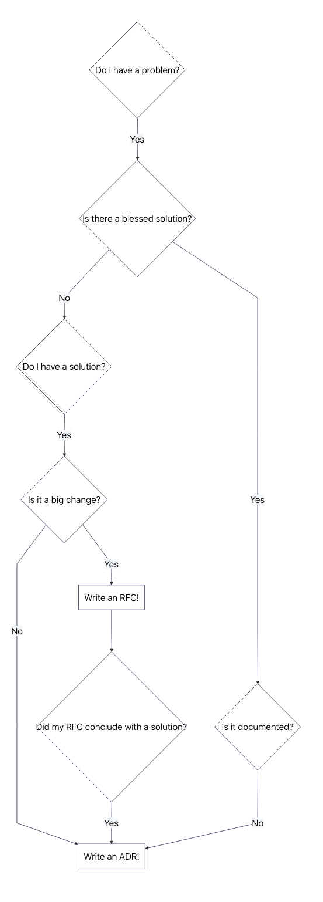

# System Architecture Decision Collaboration

DeciCollab is a short and impactful name that emphasizes both the decision-making process and the collaborative nature of the project. Here's how you could further position DeciCollab:

* __System Architecture__: System architecture is constantly evolving and can only be successfully shaped through a sustainable process of change. The requirements and priorities regarding quality are subject to significant temporal fluctuations, requiring flexible and future-oriented approaches.
* __Core Focus__: DeciCollab is a repository designed to streamline and document the ideas how architecture decisions made within a collaborative environment. Whether it's architectural choices, technical debt, or strategic product decisions, this repository serves as the central hub for all decision-related discussions.
* __Collaborative Element__: The name “Collab” points directly to the importance of inclusivity and communication across multiple teams. It implies an open, transparent process where all stakeholders—developers, product owners, architects, and other team members—have a voice in the architetecture decision-making.
* __Streamlining Decision Tracking__: By using DeciCollab, teams can document decisions through structured templates (such as Architecture Decision Records (ADRs) and Technichal Dept Records (TDRs)) that include the rationale behind decisions, trade-offs, and impacts. This helps everyone keep track of past decisions, especially for complex projects or systems.
__Optimized for Iteration__: The ADRs and TDRs encourages frequent revisiting and updating of decisions as the project evolves, so it fits well in environments where constant adaptation and improvements are necessary.

Possible Features for the Repository:

* Define a Innersource Pattern for ADRs/TDRs:
* Reference Tools and Tipps of architectural and technical debt decisions.

## Document Architecture Decisions Pattern

* __Documentation of Decisions__: Use Architecture Decision Records (ADR) and Technical Debt Records (TDR) to document decisions and trade-offs made across teams.
* __Collaborative Input__: Encourage cross-team contributions, with discussions around decisions to ensure diverse perspectives are considered.
* __Transparent Process__: Maintain clear, open documentation that allows anyone in the organization to review, understand, and participate in ongoing decisions.
* __Iteration and Updates__: Continuously refine decisions as the project evolves, using feedback loops and keeping all documentation up-to-date.
* __Decentralized Ownership__: Support shared ownership of decisions, ensuring teams contribute to and benefit from each other’s insights and expertise.

The first formulation of pattern:

* [Request of comment - Document Architecture Decisions Pattern](./Document-Architecture-Decisions-Pattern.md)

Reference to Innersource Patterns:

* [Innersource Patterns](https://patterns.innersourcecommons.org)
* [Pattern Template](https://patterns.innersourcecommons.org/appendix/pattern-template)

## Hints and other ideas

### Request of Commons

The Request for Comments (RFC) method is a collaborative approach to gather feedback and insights on a specific topic, proposal, or idea. It involves sharing a statement or document with stakeholders and inviting their input to ensure clarity, address concerns, and incorporate diverse perspectives.

A really good RFC collaborations pattern still exists:

* [Transparent Cross-Team Decision Making using RFCs](https://github.com/InnerSourceCommons/InnerSourcePatterns/blob/main/patterns/2-structured/transparent-cross-team-decision-making-using-rfcs.md)
  * Is ADR and TDRs practical tools or a relevant separate pattern?
* [RFC Definition](https://en.wikipedia.org/wiki/Request_for_Comments)

How you decide architecture decisions?:

* [Published by Josef Blake](https://engineering.atspotify.com/2020/04/when-should-i-write-an-architecture-decision-record/)

### Open Decision Framework

The [Open Decision Framework](https://github.com/open-organization/open-decision-framework) is a collaborative methodology used to make transparent, inclusive, and well-informed decisions. It emphasizes open communication, diverse stakeholder engagement, and iterative feedback throughout the decision-making process.

* [Open Decision Framework](https://opensource.com/open-organization/resources/open-decision-framework)

### Technical Dept Records

Technical Debt Records (TDRs) are a structured approach to documenting and managing technical debt within software projects. They provide a standardized format to record instances of technical debt, including details such as the nature of the debt, its implications, and strategies for resolution. Implementing TDRs enhances transparency, facilitates better decision-making, and aids in prioritizing technical debt remediation efforts.

* [Technical Debt Records Idea](https://www.heise.de/blog/Technical-Debt-Records-Dokumentation-technischer-Schulden-9876115.html)

### Arc 42

[arc42](https://arc42.org) is a proven and practical framework for documenting and communicating software and system architectures. It provides a template that guides architects through systematically capturing essential aspects of an architecture, such as goals, requirements, constraints, solution building blocks, and runtime behavior.

* [arc42 quality model](https://quality.arc42.org/articles/arc42-quality-model)

## More References

* [Architecting Success: A Comprehensive Guide to Robust Architecture Decision Records](https://medium.com/@patrickkoss/architecting-success-a-comprehensive-guide-to-robust-architecture-decision-records-4c18e6888ba1)
* [Documenting architecture decisions](https://cognitect.com/blog/2011/11/15/documenting-architecture-decisions)
* [How to write effective documentation for your open source project](https://opensource.com/article/20/3/documentation?extIdCarryOver=true&sc_cid=701f2000001Css0AAC)
* [ISO/IEC 25010 - Quality of Software](https://iso25000.com/index.php/en/iso-25000-standards/iso-25010)
* [Learnings from using ADR in a real project](https://blog.unexist.dev/documentation/myself/2021/08/18/learnings-from-using-adr-in-a-real-project.html)
* [Open Decision Framework](https://opensource.com/open-organization/resources/open-decision-framework?extIdCarryOver=true&sc_cid=701f2000001Css0AAC)
* [Requests for Comments](https://en.wikipedia.org/wiki/Request_for_Comments)
* [Technical Debt Records Idea](https://www.heise.de/blog/Technical-Debt-Records-Dokumentation-technischer-Schulden-9876115.html)
* [Why Every Development Team Needs Architecture Decision Records](https://medium.com/@tyschenk20/why-every-development-team-needs-architecture-decision-records-ec78cde47e8d)
* [Why you should be using architecture decision records to document your project](https://www.redhat.com/en/blog/architecture-decision-records)
* [Writes Workshop](https://hillside.net/conferences/plop/235-how-to-hold-a-writers-workshop)
Technical-Debt-Records-Dokumentation-technischer-Schulden-9876115.html)
* [30-years-of-rfcs](https://www.rfc-editor.org/rfc/rfc2555.txt)
* [When Should I Write an Architecture Decision Record](https://engineering.atspotify.com/2020/04/when-should-i-write-an-architecture-decision-record/)
https://opensource.com/article/20/3/documentation?extIdCarryOver=true&sc_cid=701f2000001Css0AAC

`|-o-|` - The Humbled Sign Painter - <a href="mailto://peter.rossbach@bee42.com">Peter</a>