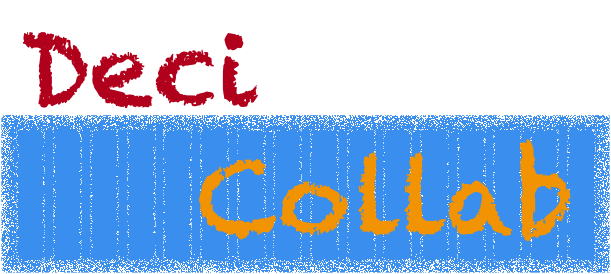
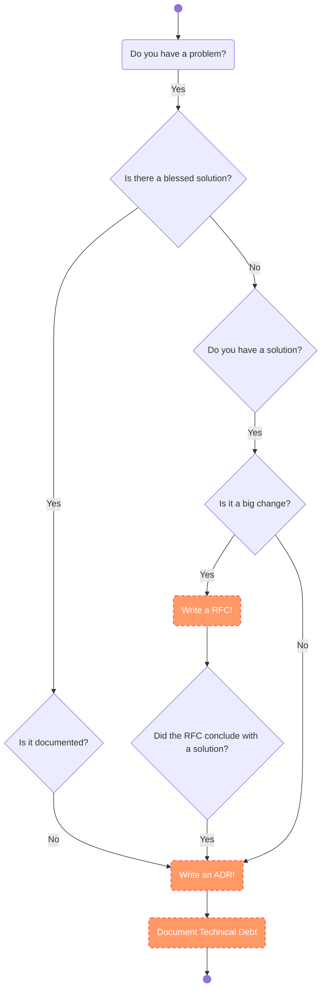

# System Architecture Decision Collaboration

DeciCollab is a short and impactful name that emphasizes both the decision-making process and the collaborative nature of the project. Here's how you could further position DeciCollab:

* __Transparent System Architecture documentation__: 
  * System architecture is in a constant state of evolution and can only be effectively shaped through a sustainable and adaptive change process. Quality requirements and priorities are subject to significant fluctuations over time, necessitating flexible and forward-thinking strategies. One of the most impactful shifts is adopting a transparency-focused approach by thoroughly documenting your architecture and the technical debt associated with your decisions.
* __Core Focus__: 
  * DeciCollab is a repository designed to streamline and document the ideas how architecture decisions made within a collaborative environment. Whether it's architectural choices, technical debt, or strategic product decisions, this repository serves as the central hub for all decision-related discussions.
* __Collaborative Element__:
  * The name “Collab” points directly to the importance of inclusivity and communication across multiple teams and inside a small team. It implies an open, transparent process where all stakeholders—developers, product owners, architects, and other team members—have a voice in the architetecture decision-making.
* __Streamlining Decision Tracking__:
  * By using DeciCollab, teams can document decisions through structured templates (such as Architecture Decision Records (ADRs) and Technichal Dept Records (TDRs)) that include the rationale behind decisions, trade-offs, and impacts. This helps everyone keep track of past decisions, especially for complex projects or systems.
* __Optimized for Iteration__:
  * The ADRs and TDRs encourages frequent revisiting and updating of decisions as the project evolves, so it fits well in environments where constant adaptation and improvements are necessary.

Possible Features for the Repository:

* Define a Innersource Pattern for ADRs/TDRs:
* Reference Tools and Tipps of architectural and technical debt decisions.
* Discuss the role of RFCs and why ADR's so important.

## Document Architecture Decisions Pattern

* __Documentation of Decisions__:
  * Use Architecture Decision Records (ADR) and Technical Debt Records (TDR) to document decisions and trade-offs made across teams or your system.
* __Collaborative Input__:
  * Encourage cross-team contributions, with discussions around decisions to ensure diverse perspectives are considered.
* __Transparent Process__:
  * Maintain clear, open documentation that allows anyone in the organization to review, understand, and participate in ongoing decisions.
* __Iteration and Updates__:
  * Continuously refine decisions as the project evolves, using feedback loops and keeping all documentation up-to-date.
* __Decentralized Ownership__:
  * Support shared ownership of decisions, ensuring teams contribute to and benefit from each other’s insights and expertise.

To fully understand ADRs we need to define some extra terms:

* __Architecturally Significant Requirements (ASR)__:
  * This is the change that demands an alteration to our system architecture. An example might be we need to have our application send emails to users.
* __Architecture Decision (AD)__:
  * The decision you make on how to address your ASR. In our example we may have decided to migrate form a classical OnPrime VMs to Cloud Based Kubernetes.
  * or __Architectural Design Decisions (ADDs)__
* __Architecture Decision Record (ADR)__:
  * Document this decision.
* __Architecture Decision Log (ADL)__:
  * The collection of ADRs representing.
  * Define Searchable content.
* __Architecture Knowledge Management (AKM)__:
  * The practice of systematically capturing, organizing, and sharing architectural decisions, rationale, and insights to ensure clarity, alignment, and reusability across teams and projects.
  * or __Software architecture knowledge management (SAKM)__
* __Architecture Decision Process (ADP)__:
  * The Proecess of creation, adpotion and inspection of the ADs

The first formulation of pattern:

* [Request for comments - Document Architecture Decisions Pattern](./Document-Architecture-Decisions-Pattern.md)
* [ADR Template](./ADR-Template.md)
* [Documents with Record FAQ](./RECORD-FAQ.md)
* [AWS ADR Process](./AWS-ADR-Process.md)

Reference to Innersource Patterns:

* [Innersource Patterns](https://patterns.innersourcecommons.org)
* [Pattern Template](https://patterns.innersourcecommons.org/appendix/pattern-template)

## Collaboration Ideas

### Architecture Decision Records

[Architecture Decision Records (ADRs)](https://adr.github.io) are concise, structured documents used to capture key decisions made during software architecture development. Each ADR outlines the context, alternatives, rationale, and consequences of a specific decision.

An ADR includes:

* __Title__: A clear description of the decision.
* __Context__: Background information and relevant constraints.
* __Decision__: The choice made.
* __Alternatives__: Options considered, with reasons for rejection.
* __Consequences__: Impact of the decision, both positive and negative.

ADRs ensure traceability, transparency, and alignment among stakeholders, helping teams understand and revisit past decisions as the system evolves.

* [Documenting architecture decisions](https://cognitect.com/blog/2011/11/15/documenting-architecture-decisions)
* [ADR Template](./ADR-Template.md)
* [Y-Statements](https://medium.com/olzzio/y-statements-10eb07b5a177)

### Arc 42

[arc42](https://arc42.org) is a proven and practical framework for documenting and communicating software and system architectures. It provides a template that guides architects through systematically capturing essential aspects of an architecture, such as goals, requirements, constraints, solution building blocks, and runtime behavior.

* [arc42 quality model](https://quality.arc42.org/articles/arc42-quality-model)
* [ADR cards42 template](https://cards42.org/#adr)

### Open Decision Framework

The [Open Decision Framework](https://github.com/open-organization/open-decision-framework) is a collaborative methodology used to make transparent, inclusive, and well-informed decisions. It emphasizes open communication, diverse stakeholder engagement, and iterative feedback throughout the decision-making process.

* [Open Decision Framework](https://opensource.com/open-organization/resources/open-decision-framework)

### Request for Comments

The Request for Comments (RFC) method is a collaborative approach to gather feedback and insights on a specific topic, proposal, or idea. It involves sharing a statement or document with stakeholders and inviting their input to ensure clarity, address concerns, and incorporate diverse perspectives.

A really good RFC collaborations pattern still exists:

* [Transparent Cross-Team Decision Making using RFCs](https://github.com/InnerSourceCommons/InnerSourcePatterns/blob/main/patterns/2-structured/transparent-cross-team-decision-making-using-rfcs.md)
  * Is ADR and TDRs practical tools or a relevant separate pattern?
* [RFC Definition](https://en.wikipedia.org/wiki/Request_for_Comments)
* [Differences between RFCs and ADRs](https://news.ycombinator.com/item?id=26057068)

How you decide architecture decisions?

__Picture 4__: Josef Blake architecture decision record diagram

* [Published by Josef Blake](https://engineering.atspotify.com/2020/04/when-should-i-write-an-architecture-decision-record/)

### Technical Debt Records

[Technical Debt Records (TDRs)](https://github.com/ms1963/TechnicalDebtRecords) are a structured approach to documenting and managing technical debt within software projects. They provide a standardized format to record instances of technical debt, including details such as the nature of the debt, its implications, and strategies for resolution. Implementing TDRs enhances transparency, facilitates better decision-making, and aids in prioritizing technical debt remediation efforts.

* [Technical Debt Records Idea](https://www.heise.de/blog/Technical-Debt-Records-Dokumentation-technischer-Schulden-9876115.html)

### Techradar

The Technology Radar is a bi-annual publication that provides insights into emerging technologies, tools, techniques, and platforms shaping the tech landscape. It categorizes items into Adopt, Trial, Assess, and Hold, offering actionable advice to guide technology adoption and innovation strategies. The Radar serves as a valuable resource for organizations and developers to evaluate trends, stay informed, and make informed decisions in a rapidly evolving ecosystem.

Examples:

* [Thoughtworks Technology Radar](https://www.thoughtworks.com/radar)
  * [Thoughtworks byor](https://www.thoughtworks.com/radar/byor)
* [Zalando Tech-radar](https://opensource.zalando.com/tech-radar/)
  * [Technology Choices at Zalando Tech Radar Update](https://engineering.zalando.com/posts/2020/07/technology-choices-at-zalando-tech-radar-update.html)

## ADR readings

* [Architectural Decision - AD](https://en.wikipedia.org/wiki/Architectural_decision)
* [Architecture Desision Records: How and why use ADRs? ](https://scrum-master.org/en/architecture-decision-record-how-and-why-use-adrs/)
* [Architecture decision record (ADR) - Joel Parker Henderson](https://github.com/joelparkerhenderson/architecture-decision-record)
  * Realy good references and documentation
* [Architectural Decisions — The Making Of](https://ozimmer.ch/practices/2020/04/27/ArchitectureDecisionMaking.html)
* [ADR Hub](https://adr.github.io/)
* [ADRs—Explicit Decisions For Better And Faster Software](https://qeunit.com/blog/adrs-explicit-decisions-for-better-and-faster-software/)
* [Architecting Success: A Comprehensive Guide to Robust Architecture Decision Records](https://medium.com/@patrickkoss/architecting-success-a-comprehensive-guide-to-robust-architecture-decision-records-4c18e6888ba1)#
* [AWS - Architectural Decision Process](https://docs.aws.amazon.com/prescriptive-guidance/latest/architectural-decision-records/adr-process.html)
* [Documenting architecture decisions](https://cognitect.com/blog/2011/11/15/documenting-architecture-decisions)
* [Documenting Design Decisions using RFCs and ADRs](https://brunoscheufler.com/blog/2020-07-04-documenting-design-decisions-using-rfcs-and-adrs)
* [Design- Practice Pepository](https://github.com/socadk/design-practice-repository)
* [How to write effective documentation for your open source project](https://opensource.com/article/20/3/documentation?extIdCarryOver=true&sc_cid=701f2000001Css0AAC)
* [How to Write Requests for Comments (RFCs) and Architecture Decision Reviews (ADRs)](https://jc1175.medium.com/how-to-write-requests-for-comments-rfcs-and-architecture-decision-reviews-adrs-aa0992e3149f)
* [Improve your IT landscape with Architecture Decision Records (ADR)](https://medium.com/geekculture/improve-your-it-landscape-with-architecture-decision-records-adr-accf6d1b4e12)
* [Inverse Conway Maneuver](https://martinfowler.com/bliki/ConwaysLaw.html)
* [ISO/IEC 25010 - Quality of Software](https://iso25000.com/index.php/en/iso-25000-standards/iso-25010)
* [Learnings from using ADR in a real project](https://blog.unexist.dev/documentation/myself/2021/08/18/learnings-from-using-adr-in-a-real-project.html)
* [Open Decision Framework](https://opensource.com/open-organization/resources/open-decision-framework?extIdCarryOver=true&sc_cid=701f2000001Css0AAC)
* [Requests for Comments](https://en.wikipedia.org/wiki/Request_for_Comments)
* [SAP- Cross Product Architecture](https://community.sap.com/t5/technology-blogs-by-sap/cross-product-architecture-embracing-conway-s-law-for-better-software/ba-p/13648600)
* [Software Architecture Documentation Starter with arc42 and C4 Model](https://github.com/bitsmuggler/arc42-c4-software-architecture-documentation-example)
* [Sustainable Architectural Design Decisions](https://www.infoq.com/articles/sustainable-architectural-design-decisions/)
* [Technical Debt Records Idea](https://www.heise.de/blog/Technical-Debt-Records-Dokumentation-technischer-Schulden-9876115.html)
* [The Markdown ADR (MADR) Template Explained and Distilled](https://ozimmer.ch/practices/2022/11/22/MADRTemplatePrimer.html)
* [Using Architecture Decision Records in Open Source Projects—An MSR Study on GitHub](https://ieeexplore.ieee.org/document/10155430)
* [When Should I Write an Architecture Decision Record](https://engineering.atspotify.com/2020/04/when-should-i-write-an-architecture-decision-record/)
* [Why Every Development Team Needs Architecture Decision Records](https://medium.com/@tyschenk20/why-every-development-team-needs-architecture-decision-records-ec78cde47e8d)
* [Why you should be using architecture decision records to document your project](https://www.redhat.com/en/blog/architecture-decision-records)
* [Writes Workshop](https://hillside.net/conferences/plop/235-how-to-hold-a-writers-workshop)
* [Y-Statements](https://medium.com/olzzio/y-statements-10eb07b5a177)
* [30-years-of-rfcs](https://www.rfc-editor.org/rfc/rfc2555.txt)

`|-o-|` - The Humbled Sign Painter - <a href="mailto://peter.rossbach@bee42.com">Peter</a>