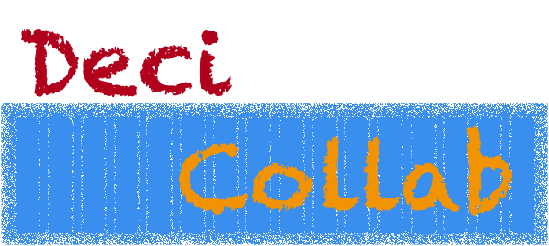

**Understanding ADRs – Documenting Decisions for Lasting Impact**

---



[Document DeciCollab](https://github.com/rossbachp/DeciCollab)

<!-- end_slide -->

## Abstract

---


---

Architectural Decision Records (ADRs) are a powerful tool for capturing the reasoning behind technical decisions. They provide a transparent, structured, and collaborative way to document choices, ensuring teams align on shared goals and have a clear historical context for future reference.

In this presentation, we’ll demystify ADRs, covering what they are, why they matter, and how to effectively create and maintain them. Participants will learn best practices for fostering open discussion, driving consensus, and building decision-making frameworks that stand the test of time. Embrace ADRs to elevate your team's collaboration and decision-making processes!

---

Peter Rossbach is the founder of bee42, a system architect, DevOps advocate, Apache member, Apache Tomcat committer, infracoder, and IT mentor. His expertise helps companies gain new insights, and he trains the next generation of Cloud Native Engineers.

<!-- end_slide -->

## ADR - Workshop Agenda


<!-- end_slide -->

## ADR - Governance Model

---


<!-- end_slide -->

## ADR - Process

---


<!-- end_slide -->

## ADR - Template

<!-- column_layout: [1, 1] -->

<!-- column: 0 -->

* __Title__ - `ADR-0001_-<name>` or `ADR-20250123_<name>`
* __Metadata__ - Tags, References, Date, changelog, Meetings, Committers
* __Status__ - Proposed, Accepted, Rejected, Deprecated, Superseded, Implemented, Revisited
* __Context__ - Why
* __Decision__ - What and How
* __Alternatives__ - Other options
* __Consequences__ - Technical Debt, Timeline, Objectives and Results
* __Notes__ - voting explained, ideas to implement

<!-- column: 1 -->

```markdown
# ADR-0001: Document with Architecture Decision Records

## Metadata

Title:  ADR-0001_Document-With-Architecture-Decision-Records
Date:   20250123
Author: [Peter Rossbach](mailto://peter.rossbach@bee42.com)
Keywords: ADR
Tags: type=organisation

## Status

[Drafted | Proposed | __Accepted__ | Rejected | Deprecated | Superseded | Implemented]

## Context

We need to record the architectural decisions made on this project.

## Decision

We will use Architecture Decision Records, as described by Michael Nygard in this article:

* [Documenting architecture decisions](http://thinkrelevance.com/blog/2011/11/15/documenting-architecture-decisions)

## Consequences

See Michael Nygard's article, linked above.
```

* [Original ADR Example - npryce]
(https://github.com/npryce/adr-tools/blob/master/doc/adr/0001-record-architecture-decisions.md)

<!-- end_slide -->

## ADR - Status

* __Drafted__:
  * The decision is prepared for proposing.
* __Proposed__:
  * The decision is under consideration and open for discussion. No final agreement has been reached.
* __Accepted__:
  * The decision has been reviewed and agreed upon by stakeholders. It is now part of the system architecture.
* __Rejected__:
  * The decision has been considered but was ultimately not approved or implemented.
* __Deprecated__:
  * The decision is no longer valid due to changes in requirements, technologies, or system priorities. It has been replaced or is planned for removal.
* __Superseded__:
  * The decision has been replaced by another ADR that reflects a more up-to-date solution.
* __Implemented__:
  * The decision has been fully integrated into the system and is currently in use.
* __Revisited__:
  * The decision is being reviewed to assess its relevance or effectiveness, usually triggered by new information or changing conditions.

<!-- end_slide -->

## ADR - Status Flowchart


<!-- end_slide -->

## ADR - Meetings

* Owner and Committer Meeting
  * Requirements and Context
  * Discus the ADR and options
* Writers Workshop
  * Explain the status of the ADR
  * Community ask questions
  * Feedback
  * Out of the Box ideas
* Decision Meeting
  * Decide
  * Sync/async - Voting with arguments
  * Superseded a ADR
  * Review Governance Model and Practice
* Pair Writing Sessions
  * Contribute to the document
  * Implementation

<!-- end_slide -->

## Writer’s Workshop

---

### Key Components of a Writer’s Workshop

* __Writing Time__
  * Writers draft, revise, and refine their work, often based on prompts or themes.
* __Sharing & Feedback__
  * Participants present their writing and receive constructive critiques.
* __Discussion & Reflection__
  * Writers and reviewers analyze strengths, areas for improvement, and possible revisions.
* __Revision & Growth__
  * Writers refine their work based on feedback, learning from the process.

---

### Goals of a Writer’s Workshop

* Improve writing skills through continuous practice and critique.
* Encourage self-reflection and revision as part of the creative process.
* Build a supportive writing community that values diverse voices and styles.

<!-- end_slide -->

## Rules of a Writer’s Workshop

---

* __Respect All Contributions__
  * Provide constructive feedback while respecting the writer’s intent and style.
* __Listen Before Critiquing__
  * Allow the writer to fully present their work before offering comments.
* __Focus on the Writing, Not the Writer__
  * Critique the work, not the person. Keep feedback professional and supportive.
* __Be Specific in Feedback__
  * Use examples to highlight strengths and areas for improvement. Avoid vague statements like “I didn't like it” without explanation.
* __Balance Praise and Critique__
  * Acknowledge what works well along with suggestions for improvement.
* __Encourage Growth, Not Perfection__
  * The goal is to help each writer improve, not to demand flawlessness.
* __Follow Time Limits__
  * Be mindful of everyone’s time. Keep discussions focused and productive.
* __Confidentiality Matters__
  * Respect the privacy of workshop discussions and do not share others' work without permission.
* __Writers Have the Final Say__
  * Feedback is a suggestion, not a directive. The writer decides which changes to make.

<!-- end_slide -->

## ADR - How to Hold a Writer’s Workshop

---

* __Preparation__
  * Writers submit drafts in advance for review.
* __Seating Circle__
  * Participants sit in a circle for open discussion.
* __Author Reads Quietly__
  * The author listens while others discuss their work.
* __Start with Positives__
  * Begin with strengths before critiques.
* __Constructive Feedback__
  * Offer clear, actionable suggestions.
* __Avoid Defensiveness__
  * The author does not justify their work during feedback.
* __Moderator Guides Discussion__
  * Keeps conversation focused and productive.
* __Wrap-Up__
  * Summarize key insights and next steps.

---

* [Writers Workshop by Hillside](https://hillside.net/conferences/plop/235-how-to-hold-a-writers-workshop)

<!-- end_slide -->

## ADR - Voting Guidelines

<!-- column_layout: [1, 1] -->

<!-- column: 0 -->

### Rules:

- The ADR must be discussed publicly and fully documented.
- A minimum of three committers must sign the decision record (ADR).
- The voting date must be announced in a public channel in advance.
- A minimum of three positive votes must be exists.
- For an approval, there must be more "+1" votes than "-1" votes.
- Voting periods should generally run for at least 72 hours to provide an opportunity for all concerned persons to participate, regardless of their geographic location.

<!-- column: 1 -->

### Voting:

- **+1**:
  - Indicates **YES**, accepting the decision and its documented consequences.
- **0**:
  - Indicates a neutral stance **(YES/NO)**.
- **-1**:
  - Indicates **NO** and requires a rationale, which must be clearly documented.

<!-- end_slide -->

## ADR - Workshop

---

### Tutor

Guide students on adopting Kubernetes for container orchestration.

### Students

* Understand logging best practices in a containerized environment.
* Decide whether to use Golang for development.
* Compare Microservices vs. Monolith architectures.
* Learn how to migrate applications to containers effectively.

### Post-Writing Activity

* Present findings at the Writer’s Workshop for discussion.
* Feedback Process
* Receive constructive critiques from peers and mentors.
* Discuss strengths, improvements, and refinements.

<!-- end_slide -->

## ADR - Tools

---

### Why Use ADR Tools?

* Consistency – Standardizes the format of Architecture Decision Records (ADRs).
* Traceability – Tracks decisions over time with clear historical context.
* Collaboration – Encourages team discussions and documentation.
* Version Control – Stores ADRs in Git for easy auditing and rollbacks.
* Automation – Simplifies the creation and management of ADRs.
* Clarity – Makes architectural choices transparent for future stakeholders.

### Tools

* [ADR Templates - markdown ](https://adr.github.io/adr-templates/)
* [ADR-Tools - asciidoc](https://github.com/unexist/adr-tools)
* [ADR-Tools - markdown](https://github.com/adr/adr-tools)
* [ADR-Tools Nat Pryce - markdown](https://github.com/npryce/adr-tools)
* [E-ADR](https://github.com/adr/e-adr)
* [MADR Template- markdown](https://adr.github.io/madr/)
* [Record-Tools - asciidoc](https://github.com/unexist/record-tools)

<!-- end_slide -->

## ADR - Summary

---
<!-- column_layout: [1, 1] -->

<!-- column: 0 -->

- **Document Decisions**
  - Use a standard template
  - All people must accept the governance rules of your ADR Process

- **Collobrations**
  - Discuss your context
  - Leave out your box and respect feedback
  - Check the alternative options

- **Before Decide**
  - Implement a short POC
  - Describe the consequences, if something goes wrong!
  - Be motivated to accept the resulting challenges!

- **All people respect the process**
  - Nobody can overrule the decisions
  - Everyone is welcome to contribute
  - Don't use manipulations to decide something!
  - Don't block a decision without accepted arguments

<!-- column: 1 -->

Many thanks for listing,

* `|-o-|` The humbled sign painter - Peter Rossbach
* Christoph Kappel


Powerby:

- [presenterm](https://github.com/mfontanini/presenterm)
- [DeciCollab](https://github.com/rossbachp/DeciCollab)
- © 2025 bee42 solutions gmbh

---

