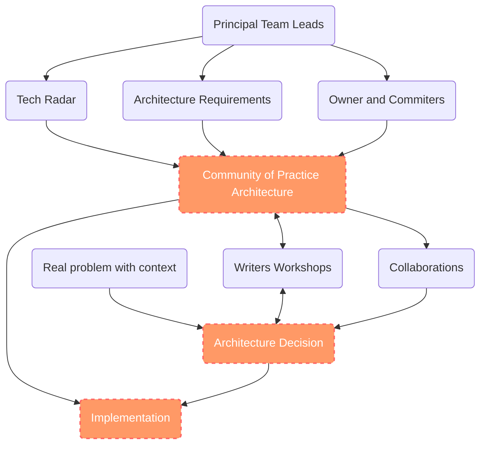
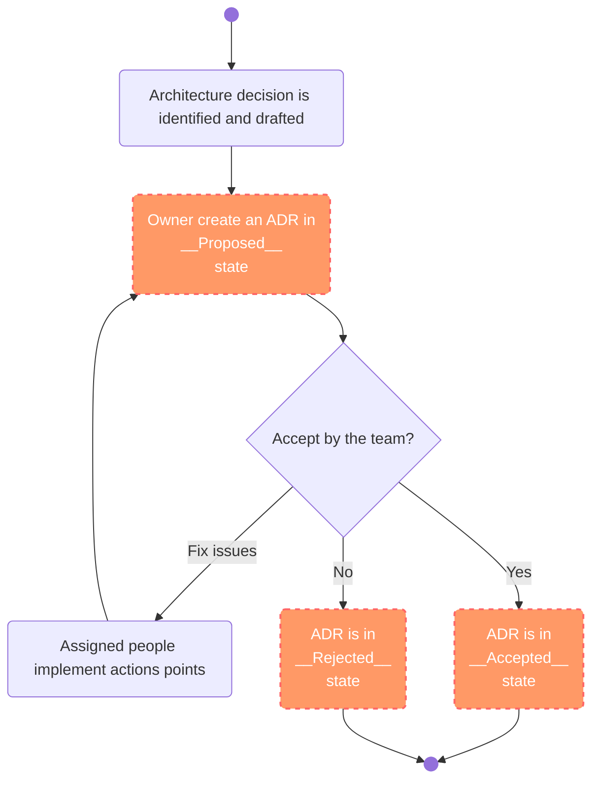

**Understanding ADRs – Documenting Decisions for Lasting Impact**

---


<!-- end_slide -->

## Abstract

---


---

Architectural Decision Records (ADRs) are a powerful tool for capturing the reasoning behind technical decisions. They provide a transparent, structured, and collaborative way to document choices, ensuring teams align on shared goals and have a clear historical context for future reference.

In this presentation, we’ll demystify ADRs, covering what they are, why they matter, and how to effectively create and maintain them. Participants will learn best practices for fostering open discussion, driving consensus, and building decision-making frameworks that stand the test of time. Embrace ADRs to elevate your team's collaboration and decision-making processes!

---

Peter Rossbach is the founder of bee42, a system architect, DevOps advocate, Apache member, Apache Tomcat committer, infracoder, and IT mentor. His expertise helps companies gain new insights, and he trains the next generation of Cloud Native Engineers.

<!-- end_slide -->

## ADR - Governance Model

---



<!-- end_slide -->

## ADR - Process

---



<!-- end_slide -->

## ADR - Template

* __Title__ - `ADR-0001-<name>` or `ADR-20250123-<name>`
* __Metadata__ - Tags, References, Date, changelog, Meetings, Committers
* __Status__ - Proposed, Accepted, Rejected, Deprecated, Superseded, Implemented, Revisited
* __Context__ - Why
* __Decision__ - What and How
* __Alternatives__ - Other options
* __Consequences__ - Technical Debt, Timeline, Objectives and Results
* __Notes__ - voting explained, ideas to implement

<!-- end_slide -->

## ADR - Example

```markdown

# Record architecture decisions

## Title

ADR-0001-Record-Architecture-Decisions

## Metadata

Date: 2016-02-12
Keywords: ADR
Tags: tyoe=organisation

## Status

Accepted

## Context

We need to record the architectural decisions made on this project.

## Decision

We will use Architecture Decision Records, as described by Michael Nygard in this article: http://thinkrelevance.com/blog/2011/11/15/documenting-architecture-decisions

## Consequences

See Michael Nygard's article, linked above.
```

* [Original ADR- npryce](https://github.com/npryce/adr-tools/blob/master/doc/adr/0001-record-architecture-decisions.md)

<!-- end_slide -->

## ADR - Status

* __Proposed__:
  * The decision is under consideration and open for discussion. No final agreement has been reached.
* __Accepted__:
  * The decision has been reviewed and agreed upon by stakeholders. It is now part of the system architecture.
* __Rejected__:
  * The decision has been considered but was ultimately not approved or implemented.
* __Deprecated__:
  * The decision is no longer valid due to changes in requirements, technologies, or system priorities. It has been replaced or is planned for removal.
* __Superseded__:
  * The decision has been replaced by another ADR that reflects a more up-to-date solution.
* __Implemented__:
  * The decision has been fully integrated into the system and is currently in use.
* __Revisited__:
  * The decision is being reviewed to assess its relevance or effectiveness, usually triggered by new information or changing conditions.

<!-- end_slide -->

## ADR - Meetings

* Owner and Committer Meeting
  * Requirements and Context
  * Discus the ADR and options
* Writers Workshop
  * Explain the status of the ADR
  * Community ask questions
  * Feedback
  * Out of the Box ideas
* Decision Meeting
  * Decside
  * Voting with arguments
  * Superseded a ADR
* Pair Writing Sessions
  * Contribute to the document
  * Implementation

<!-- end_slide -->

## ADR - Voting Guidelines

<!-- column_layout: [1, 1] -->

<!-- column: 0 -->

Rules:

- The ADR must be discussed publicly and fully documented.
- A minimum of three committers must sign the decision record (ADR).
- The voting date must be announced in a public channel in advance.
- A minimun of three positive votes must be exists.
- For an approval, there must be more "+1" votes than "-1" votes.
- Voting periods should generally run for at least 72 hours to provide an opportunity for all concerned persons to participate, regardless of their geographic location.

<!-- column: 1 -->

- **+1**: Indicates **YES**, accepting the decision and its documented consequences.
- **0**: Indicates a neutral stance **(YES/NO)**.
- **-1**: Indicates **NO** and requires a rationale, which must be clearly documented.

<!-- end_slide -->

## ADR - Summary

---
<!-- column_layout: [1, 1] -->

<!-- column: 0 -->

- **Document Decisions**
  - Use a standard template
  - Accept the governance rules of you ADR Process

- **Collobrations**
  - Discuss your context
  - Leave out your box and respect feedback
  - Check the alternative options

- **Before Decide**
  - Implement a short POC
  - Describe the consequences, if something goes wrong!
  - Be motivated to accept the resulting challenges!

- **All people respect the process**
  - Nobody can overrule the decisions
  - Everyone is welcome to contribute
  - Don't use manipulations to decide something!
  - Don't block a decision without accepted arguments

<!-- column: 1 -->

Many thanks for listing,

`|-o-|` The humbled sign painter - Peter


Powerby:

- [presenterm](https://github.com/mfontanini/presenterm)
- [DeciCollab](https://github.com/rossbachp/DeciCollab)
- © 2025 bee42 solutions gmbh

---

